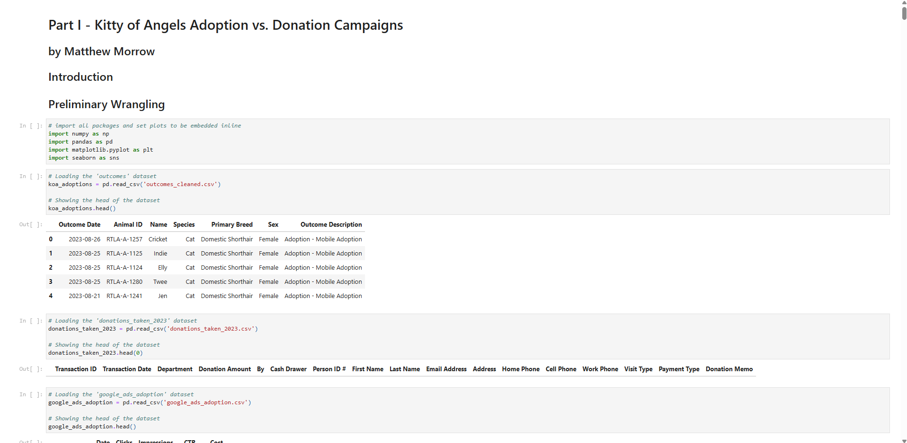

# Data-Driven Insights for Nonprofit Campaigns (Portfolio)

**By:** Matthew Morrow

**Live Demo:** [matthewmorrow.github.io/Part_I_Adoption_vs_Donation/](matthewmorrow.github.io/Part_I_Adoption_vs_Donation/)

**Project Context:** As a Google Ads specialist for the nonprofit, Kitty of Angels, this Python-based data analysis project demonstrates my ability to leverage data to understand and optimize online campaigns.

**Goal:**  Analyze adoption and donation campaign data using Pandas, Matplotlib, and Seaborn to gain actionable insights for improving ad performance and resource allocation.

**Key Skills Showcased:**

*   **Python Data Analysis:**  Proficiency in Pandas, Matplotlib, Seaborn for data wrangling, analysis, and visualization.
*   **Campaign Performance Analysis:**  Demonstrates skills in evaluating Google Ads campaign data (clicks, costs) in relation to real-world outcomes (adoptions, donations).
*   **Data-Driven Optimization:**  Highlights the potential for using data insights to inform and improve nonprofit campaign strategies.

**Project Files:** `Part_I_Adoption_vs_Donation.ipynb` (Jupyter Notebook), data CSVs, `README.md`.

---
*Portfolio Demonstration Only*
